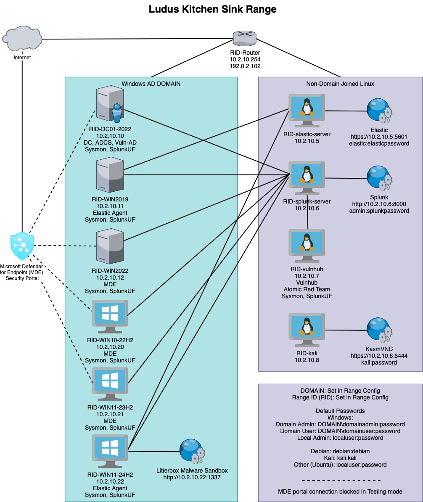

# Ludus Kitchen_sink Range

Ludus range with AD DC, servers, and workstations. ADCS, Vulnerable-AD, MDE, Elastic, Sysmon, Splunk, Litterbox, kali, and vulnhub server deployed.



# Setup

Recommended server resources for the Ludus Debian VM are:  
- CPU: 1 Socket, 14 Cores  
- RAM: 54GB RAM  
- Disk: 600GB-1TB  

You will want to have the home hypervisor 128GB RAM upgrade installed for the full range. 
You can deploy only a subset of the range to lower RAM/disk requirements.

Recommended server resources for the Lite version: (Removed RID-WIN2019, RID-WIN10-22H2, RID-vulnhub, RID-kali)
- CPU: 1 Socket, 10 Cores  
- RAM: 34GB RAM  
- Disk: 400GB-600TB  

You should get a Ludus Server setup and configured. 
Recommend going through the Ludus Quick-Start guide to install Ludus, create your Ludus user, and deploy a test range first to get familar with Ludus:

https://docs.ludus.cloud/docs/quick-start/

Also recommended that you install and setup the Ludus Nexus-cache server. this will aide in any chocolately/package requests during setup that may get rate limited.  
You may power off the nexus-cache server after deployment or any new deployment/redeployments.  
You many not be able to deploy this with the range if running the Lite version and 34GB RAM.  


https://docs.ludus.cloud/docs/nexus-cache

Git clone/copy this repo to the Ludus Server:

```
cd /home/user
git clone https://github.com/RCStep/ludus-stuff.git
```

You will also want to git clone the ludus source repo:
```
cd /home/user
git clone https://gitlab.com/badsectorlabs/ludus.git
```

This range will need the following additional Templates installed and built:
```
cd /home/user/ludus/templates
ludus templates add -d win2019-server-x64
ludus templates add -d win10-22h2-x64-enterprise
ludus templates add -d win11-23h2-x64-enterprise
ludus templates add -d ubuntu-22.04-x64-server
cd /home/user/ludus-stuff/templates
ludus templates add -d win11-24h2-x64-enterprise-tpm --force
```

Build all of the OS templates (this will take awhile)
```
ludus templates build
```

This range will need the following Roles installed:
```
ludus ansible roles add badsectorlabs.ludus_vulhub
ludus ansible roles add badsectorlabs.ludus_adcs
ludus ansible roles add badsectorlabs.ludus_elastic_container
ludus ansible roles add professor-moody.ludus_litterbox

cd /home/user/ludus-stuff/roles
ludus ansible roles add -d ludus_mde_agent --force
ludus ansible roles add -d badsectorlabs.ludus_elastic_agent --force
ludus ansible roles add -d p4t12ick.ludus_ar_windows --force
ludus ansible roles add -d p4t12ick.ludus_ar_splunk --force
ludus ansible roles add -d p4t12ick.ludus_ar_linux --force
```

# Edit the range configuration

```
nano /home/user/ludus-stuff/ranges/kitchen_sink/ludus-range-kitchensink-config.yml
```

Replace the ```domain: fqdn: changeme.net``` on each Domain joined VM with the Domain name you wish for your test deployment.

If you want to deploy MDE and can manage the deployments through your own subscription and MDE security portal, uncomment the ludus_mde_agent roles. OS installed Windows Defender will be active instead if left commented out.
```
roles:
# - ludus_mde_agent
```

If you want to change anything else about the range (the VMs deployed, the roles assigned to each VM, etc), do it now.

# Import the range configuration
```
cd /home/user/ludus-stuff/ranges/kitchen_sink
ludus range config set -f ludus-range-kitchensink-config.yml
```

# Deploy the Range
This will take a long time (several hours)
```
ludus range deploy
```

Monitor deployment logs for status and any errors:
```
ludus range logs -f
```
Cross your fingers that all range hosts are deployed with 0 Failed items listed in the final log summary.

# Troubleshooting and Maintenance

- Montior the deployment logs and note any failures during deployment. 
You will also see an error status in ```ludus range status``` 
and errors listed in ```ludus range errors``` if the deployment had issues.

- Typically, reissuing a ```ludus range deploy``` will be enough to clear up any issues with the previous range deployment. 

- If you would like to force a redeploy a single host and not the entire range, you can do so with:
```ludus range deploy -l <vm_name>,localhost --force``` (make sure to include localhost in the targets)

- If you would like to redeploy a single user defined role in the range, you can do so with:
```ludus range deploy -t user-defined-roles --only-roles <role_name>```

- If you would like to redeploy a single user defined role in the range for a single host, you can do so with:
```ludus range deploy -t user-defined-roles --only-roles <role_name> --limit "vm_name"```

- Having multiple local hosts connected to your Ludus range WireGuard network can cause connectivity issues. 
Disconnect all but one WireGuard client on your local net to resolve issues with hopping back and forth between WireGuard clients.

- In some cases, having multiple WireGuard based VPNs up can cause connectivity issues with the Ludus WireGuard connection.
Namely, having Tailscale active at the same time as the Ludus WireGuard connectin can result in limited connections. 
Enabling Tailscale "Allow local network access" (split tunnel) may help, but consider security implications.

- If you need to delete and redeploy your elastic server, you will need to reregister any elastic agents to connect to the new server.
    - Log into each Windows host as **domainadmin** and uninstall the old agent.
        - ```C:\Program Files\Elastic\Agent\elastic-agent.exe uninstall```
    - Get the new agent registration powershell commands from the Elastic "Fleet" -  "Add Agent" - "Ludus Agent Policy" - "Enroll in Fleet" - "Windows".  
        - Add --insecure to the end of the last registration command to ignore self-signed certificate issues. 
        - Your enrollment-token will be different every time you install the elastic-server.
        ```
        $ProgressPreference = 'SilentlyContinue'
        Invoke-WebRequest -Uri https://artifacts.elastic.co/downloads/beats/elastic-agent/elastic-agent-9.0.8-windows-x86_64.zip -OutFile elastic-agent-9.0.8-windows-x86_64.zip 
        Expand-Archive .\elastic-agent-9.0.8-windows-x86_64.zip -DestinationPath .
        cd elastic-agent-9.0.8-windows-x86_64
        .\elastic-agent.exe install --url=https://10.2.10.5:8220 --enrollment-token=cVJpcDNKb0IxT3lqM0NTSkI1YzM6bVBCaHhBWTdscEQ3c2IxTmk5bEg5dw== --insecure
        ```
- The Splunk Universal Forwarder (SplunkUF) is installed but disabled after installation to prevent a large nunber of events during range installation.
    - Range deployment overloads the splunk community license event capacity.
    - To reenable splunk log and sysmon collection for hosts, reenable the service on Windows and Linux hosts.
        - (windows) ```runas /user:<rangedomain>\domainadmin "sc start SplunkForwarder"```
        - (windows) ```runas /user:<rangedomain>\domainadmin "sc stop SplunkForwarder"```
        - (linux) ```sudo /opt/splunkforwarder/bin/splunk start```
        - (linux) ```sudo /opt/splunkforwarder/bin/splunk stop```
